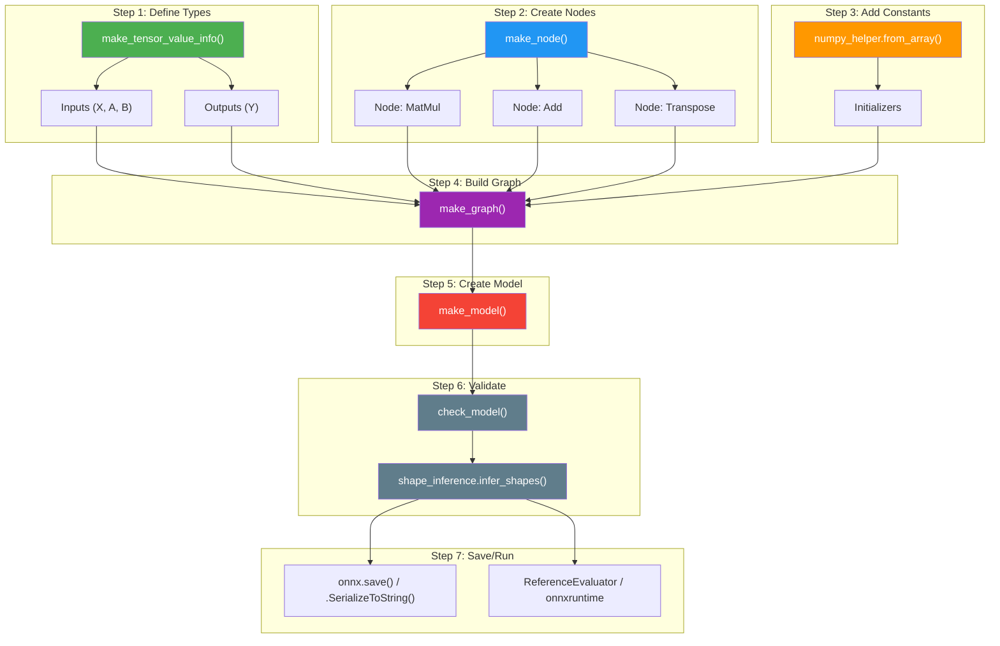
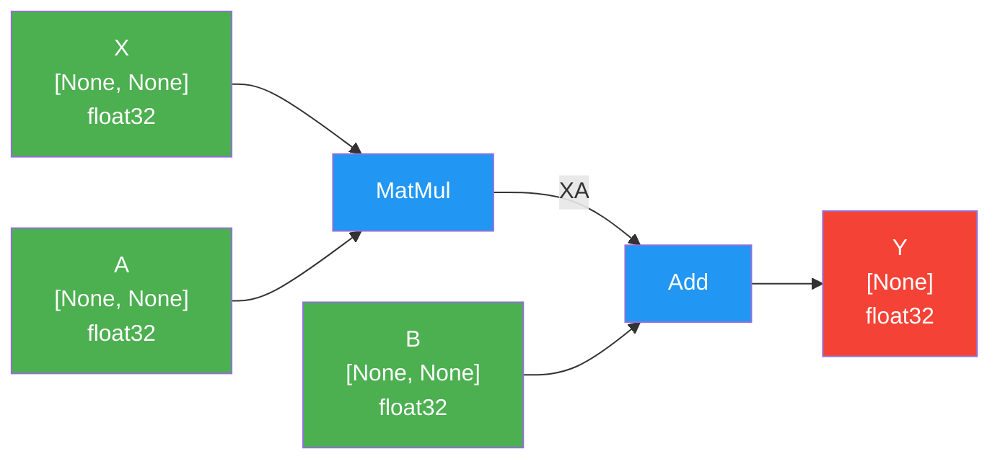
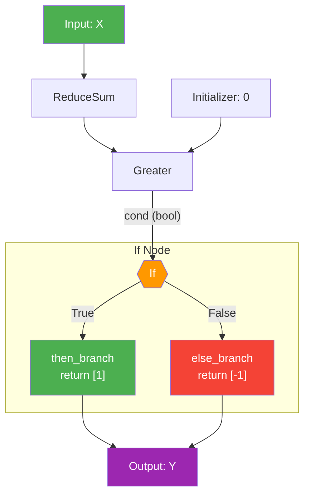

# ONNX Python API — Graph Building Flow

```mermaid
graph TD
    subgraph "Step 1: Define Types"
        MTV["make_tensor_value_info()"] --> INPUT["Inputs (X, A, B)"]
        MTV --> OUTPUT["Outputs (Y)"]
    end

    subgraph "Step 2: Create Nodes"
        MN["make_node()"] --> N1["Node: MatMul"]
        MN --> N2["Node: Add"]
        MN --> N3["Node: Transpose"]
    end

    subgraph "Step 3: Add Constants"
        NFA["numpy_helper.from_array()"] --> INIT["Initializers"]
    end

    subgraph "Step 4: Build Graph"
        MG["make_graph()"]
        INPUT --> MG
        OUTPUT --> MG
        N1 --> MG
        N2 --> MG
        N3 --> MG
        INIT --> MG
    end

    subgraph "Step 5: Create Model"
        MM["make_model()"]
        MG --> MM
    end

    subgraph "Step 6: Validate"
        CM["check_model()"]
        MM --> CM
        SI["shape_inference.infer_shapes()"]
        CM --> SI
    end

    subgraph "Step 7: Save/Run"
        SAVE["onnx.save() / .SerializeToString()"]
        RUN["ReferenceEvaluator / onnxruntime"]
        SI --> SAVE
        SI --> RUN
    end

    style MTV fill:#4CAF50,color:#fff
    style MN fill:#2196F3,color:#fff
    style NFA fill:#FF9800,color:#fff
    style MG fill:#9C27B0,color:#fff
    style MM fill:#f44336,color:#fff
    style CM fill:#607D8B,color:#fff
    style SI fill:#607D8B,color:#fff
```

# Linear Regression Graph Flow

```mermaid
graph LR
    X["X<br/>[None, None]<br/>float32"] --> MatMul
    A["A<br/>[None, None]<br/>float32"] --> MatMul
    MatMul["MatMul"] -->|"XA"| Add
    B["B<br/>[None, None]<br/>float32"] --> Add
    Add["Add"] --> Y["Y<br/>[None]<br/>float32"]

    style X fill:#4CAF50,color:#fff
    style A fill:#4CAF50,color:#fff
    style B fill:#4CAF50,color:#fff
    style MatMul fill:#2196F3,color:#fff
    style Add fill:#2196F3,color:#fff
    style Y fill:#f44336,color:#fff
```

# If Operator Control Flow

```mermaid
graph TD
    X["Input: X"] --> ReduceSum
    ReduceSum --> Greater
    Zero["Initializer: 0"] --> Greater
    Greater -->|"cond (bool)"| If

    subgraph "If Node"
        If{{"If"}}
        If -->|"True"| Then["then_branch<br/>return [1]"]
        If -->|"False"| Else["else_branch<br/>return [-1]"]
    end

    Then --> Y["Output: Y"]
    Else --> Y

    style X fill:#4CAF50,color:#fff
    style If fill:#FF9800,color:#fff
    style Then fill:#4CAF50,color:#fff
    style Else fill:#f44336,color:#fff
    style Y fill:#9C27B0,color:#fff
```
