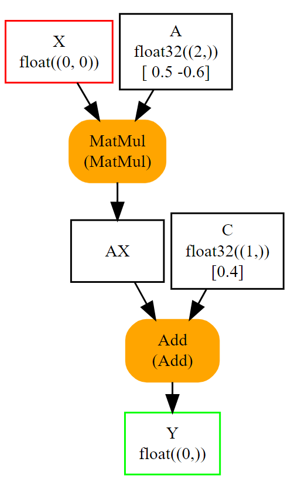

# What is ONNX?

> **Interview Relevance:** HIGH — Defining ONNX and its purpose is the most common opening question in ML infrastructure interviews

---

## Visual Overview

## Why (Motivation)
ONNX (Open Neural Network Exchange) was created to solve the interoperability problem between training frameworks and deployment runtimes. Without ONNX, teams would need N×M custom converters between N frameworks and M deployment targets.

## When (Use Cases)
- When deploying models trained in PyTorch/TensorFlow to production runtimes
- When targeting multiple hardware platforms from a single model
- When separating research (training) from engineering (deployment) teams

## How (Mechanism)
ONNX defines a standardized computational graph format using Protocol Buffers. Models are represented as DAGs of operator nodes with typed tensor inputs/outputs, versioned operator sets, and embedded constant weights.

---

## Prerequisites
- Basic Python and ML knowledge
- Understanding of training vs inference

## What You Will Learn

| Concept | Why It Matters | Interview Frequency |
|---------|---------------|:-------------------:|
| ONNX definition | Foundation for all ONNX discussions | ⭐⭐⭐ |
| History (2017, FB+MS) | Shows understanding of ecosystem evolution | ⭐⭐ |
| Interoperability problem | Core motivation for ONNX | ⭐⭐⭐ |
| Graph-based model format | How ONNX represents computation | ⭐⭐⭐ |
| ONNX vs alternatives | Trade-off analysis | ⭐⭐ |

## Key Interview Questions Answered Here
1. **What is ONNX?** → Open Neural Network Exchange — a vendor-neutral, open specification for serializing ML models as computational graphs.
2. **Why was ONNX created?** → To solve the interoperability problem between training frameworks and deployment runtimes (N×M → N+M).
3. **How is an ONNX model structured?** → As a DAG of operator nodes with typed tensor edges, initializer constants, and versioned operator sets.

## Notebooks

| Notebook | Focus | Time |
|----------|-------|:----:|
| [What_is_ONNX_Deep_Dive.ipynb](01_What_is_ONNX_Deep_Dive.ipynb) | Theory & internals | ~20 min |
| [What_is_ONNX_Apply.ipynb](02_What_is_ONNX_Apply.ipynb) | Hands-on practice | ~15 min |

## Common Mistakes & Confusions
- Thinking ONNX is a runtime (it's a format; ONNX Runtime is the runtime)
- Confusing ONNX with framework-specific serialization (pickle, SavedModel)
- Assuming ONNX guarantees performance portability (it guarantees semantic portability)

---

## Next Steps
→ [Why_ONNX_Matters](../02_Why_ONNX_Matters/)

---
**Author:** [Gaurav14cs17](https://github.com/Gaurav14cs17)
