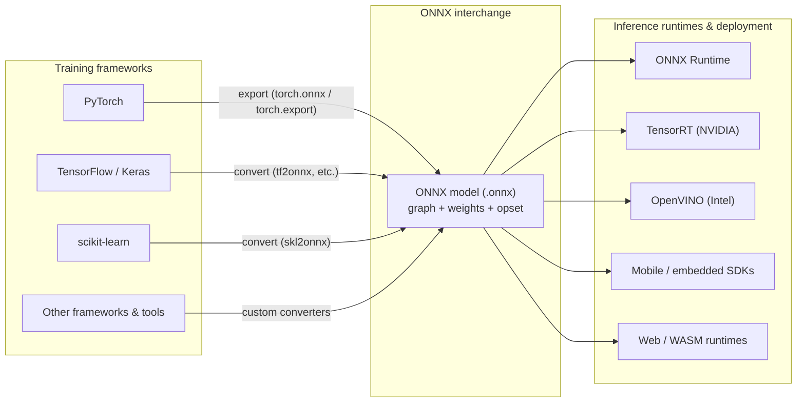

# ONNX Ecosystem Overview (Mermaid)

This diagram positions **training frameworks** on the left, the **ONNX** interchange in the center, and **inference runtimes / deployment targets** on the right—matching the mental model used throughout Chapter 1.

## How to render

- **GitHub / GitLab / many Markdown viewers:** Mermaid is rendered natively in several products.
- **Local preview:** use a Mermaid-capable editor or the Mermaid CLI to export PNG/SVG if you need a static image for slides.

## Legend

| Lane | Role |
|------|------|
| **Training frameworks** | Where parameters are learned and native graphs live |
| **ONNX** | Portable, declarative computation contract between teams |
| **Inference runtimes** | Where latency, throughput, and hardware mapping are optimized |
