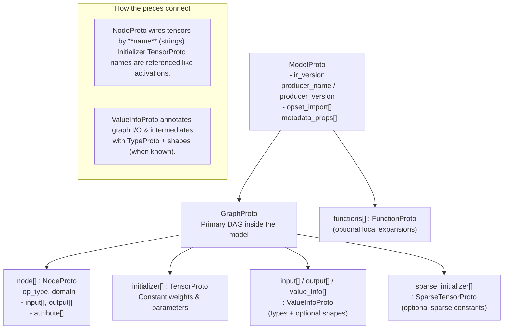

# ONNX architecture overview (Mermaid)

This diagram summarizes how the ONNX **Intermediate Representation** nests **Protocol Buffer** messages: a top-level **model** wraps **metadata** and a single main **graph**, which in turn contains **nodes** (operators), **value** metadata for intermediate results, and **initializers** (constant tensors, often weights).

## Nested view: what “contains” means

- **`ModelProto` → `GraphProto`**: almost every inference file stores its executable definition in **`model.graph`**.
- **`GraphProto` → `NodeProto[]`**: the ordered list of operators to execute (subject to topological scheduling in runtimes).
- **`GraphProto` → `TensorProto[]` (initializer list)**: dense constants embedded in the model; these are **not** outputs of nodes in the same graph (they are **given**).
- **`GraphProto` → `ValueInfoProto[]`**: the **typed interface** of the graph and optional annotations for hidden activations.

`TensorProto` therefore appears both as **initializers attached to the graph** and **nested inside attributes** (literal tensor attributes, quantization tables, etc.).

## Compact hierarchy (mental model)

- **`ModelProto`**: file-level container; holds **IR version**, **opset imports**, optional **training**/`Function` extensions, and **one primary `GraphProto`** for inference graphs.
- **`GraphProto`**: the actual **DAG**: ordered **`NodeProto` list**, **`ValueInfoProto`** for typed interface, and **`TensorProto`** initializers (constants stored inside the file).
- **`NodeProto`**: one **operator instance** (`Conv`, `MatMul`, `Add`, …) with string **tensor names** wiring it to the rest of the graph.

For the full field-level tour, see [03 — ONNX IR Specification](../03_ONNX_IR_Specification/README.md).
