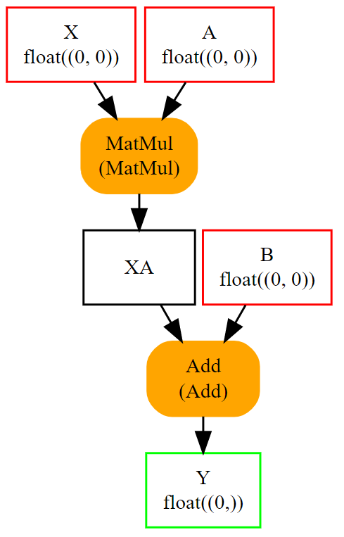
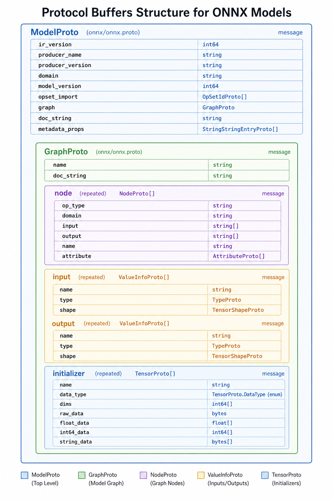

# ONNX Proto Structure

> **Interview Relevance:** HIGH — Knowing ModelProto → GraphProto → NodeProto hierarchy and how names wire the DAG is essential for debugging model exports and answering ONNX internals questions.

---

## Visual Overview

## Why (Motivation)
Understanding the ONNX Protobuf message hierarchy lets you read any `.onnx` file, debug export failures, build diagnostic models by hand, and reason about what runtimes actually consume.

## When (Use Cases)
- Debugging "invalid model" errors from `onnx.checker`
- Building custom ONNX models programmatically
- Understanding Netron visualizations at the proto level
- Answering "how does ONNX represent computation?" in interviews

## How (Mechanism)
ONNX uses nested Protobuf messages: `ModelProto` contains `GraphProto`, which contains `NodeProto` entries connected by string-name references. Weights live in `TensorProto` initializers, and types are declared via `ValueInfoProto`.

---

## Prerequisites
- [01_Protobuf_Primer](../01_Protobuf_Primer/) — What Protobuf is and why ONNX uses it

## What You Will Learn

| Concept | Why It Matters | Interview Frequency |
|---------|---------------|:-------------------:|
| ModelProto → GraphProto → NodeProto hierarchy | Core ONNX architecture | ⭐⭐⭐ |
| String-name DAG wiring | How edges work without edge objects | ⭐⭐⭐ |
| TensorProto for weights/initializers | Where model parameters live | ⭐⭐⭐ |
| ValueInfoProto and type system | Shape inference and validation | ⭐⭐ |
| AttributeProto tagged union | Static operator configuration | ⭐⭐ |
| OperatorSetIdProto | Which ops a model may invoke | ⭐⭐ |

## Key Interview Questions Answered Here
1. **How does ONNX represent a neural network?** → As a DAG of NodeProto entries inside a GraphProto, where edges are implicit string-name reuse across input/output lists.
2. **Where are model weights stored?** → In `GraphProto.initializer` as `TensorProto` messages (inline `raw_data` or external files).
3. **What is the difference between inputs and initializers?** → Inputs are dynamic values fed at runtime; initializers are constant tensors baked into the model file.

## Notebooks

| Notebook | Focus | Time |
|----------|-------|:----:|
| [ONNX_Proto_Structure_Deep_Dive.ipynb](01_ONNX_Proto_Structure_Deep_Dive.ipynb) | Theory & internals | ~20 min |
| [ONNX_Proto_Structure_Apply.ipynb](02_ONNX_Proto_Structure_Apply.ipynb) | Hands-on practice | ~15 min |

## Common Mistakes & Confusions
- Dangling names — every node input must refer to a graph input, initializer, or earlier node output
- Missing `ValueInfoProto` types on graph inputs/outputs → validation failure
- Confusing `opset_import` version with `ir_version`
- Forgetting to topologically sort nodes (ONNX spec requirement)

---

## Next Steps
→ [03_Reading_and_Writing_Models](../03_Reading_and_Writing_Models/)

---
**Author:** [Gaurav14cs17](https://github.com/Gaurav14cs17)
