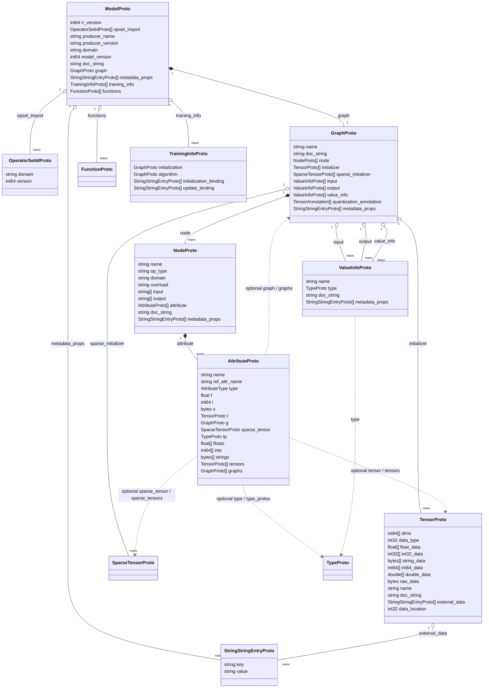

# ONNX Protobuf message hierarchy (Mermaid)

This diagram mirrors Chapter **02** and condenses the ONNX IR into a **Mermaid class-style** graph. It is intended for quick navigation, not as a replacement for reading **`onnx.proto`**.

> **Rendering:** GitHub-style Markdown renders Mermaid. VS Code + a Mermaid preview extension works locally. Export to SVG/PNG using [`mermaid-cli`](https://github.com/mermaid-js/mermaid-cli) if you need a static image for slides.

### Legend

- **Solid lines with diamond** — primary containment (`ModelProto` owns its `GraphProto`).
- **Dashed arrows** — “may embed” relationships for **attributes** (subgraphs, constant tensors).
- **`StringStringEntryProto`** — reused map-like entries for **metadata_props** and **TensorProto.external_data** key/value pairs.
- This diagram **does not** expand **`TypeProto`**, **`SparseTensorProto`**, or **`FunctionProto`** bodies—those messages are sizable on their own; open `onnx.proto` for exhaustive field lists.

---

*Chapter: [README.md](../README.md)*
