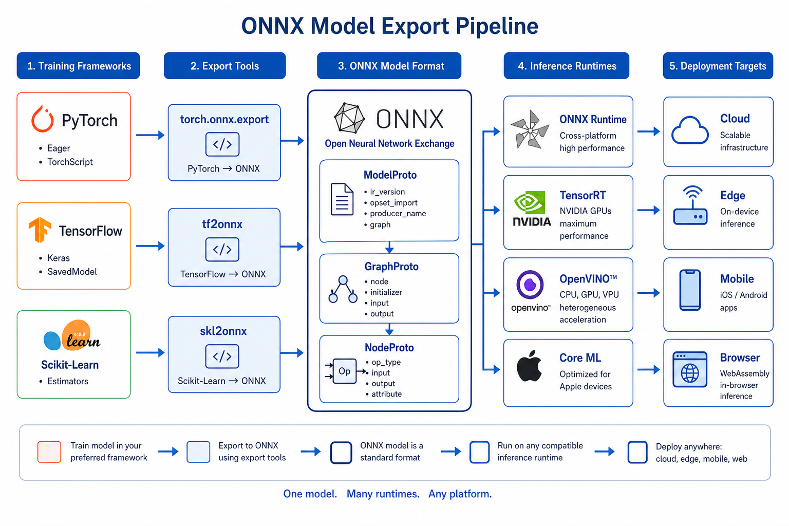
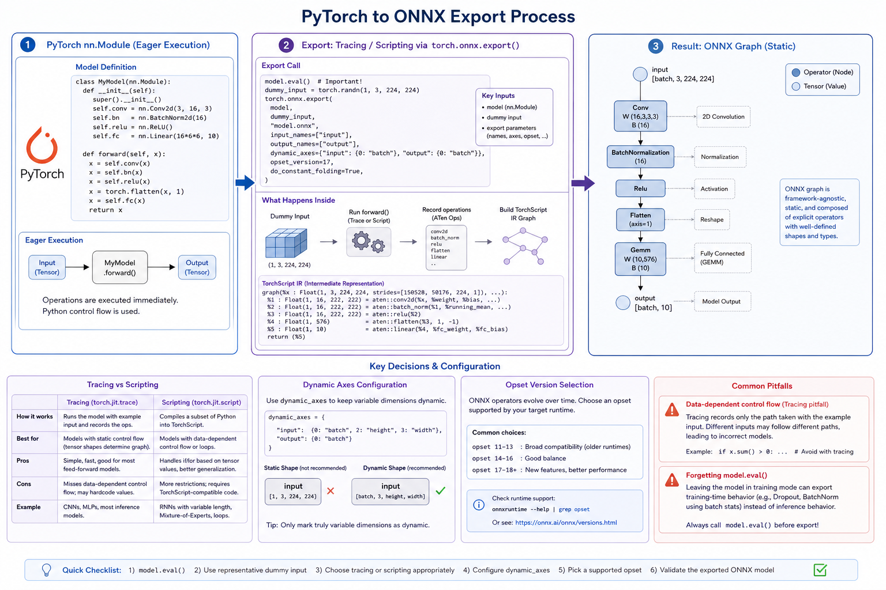

# PyTorch to ONNX

> **Interview Relevance:** HIGH — `torch.onnx.export` is the most common ONNX export path; understanding tracing vs scripting, dynamic axes, and pitfalls is essential for ML deployment interviews.

---

## Visual Overview

## Why (Motivation)
PyTorch is the dominant training framework. Exporting to ONNX enables cross-platform deployment via ONNX Runtime, TensorRT, OpenVINO, and other inference engines — often with significant speedups.

## When (Use Cases)
- Deploying PyTorch models to production inference servers
- Optimizing models with TensorRT or OpenVINO via ONNX
- Enabling cross-platform inference (CPU, GPU, edge devices)
- Serving models in non-Python environments (C++, Rust, mobile)

## How (Mechanism)
`torch.onnx.export` traces or scripts the model's forward pass, captures operations into a TorchScript graph, then lowers that graph to ONNX operators at the specified opset version.

---

## Prerequisites
- [05_ONNX_Operators_and_OpSets](../../05_ONNX_Operators_and_OpSets/) — Understanding operators and opsets

## What You Will Learn

| Concept | Why It Matters | Interview Frequency |
|---------|---------------|:-------------------:|
| `torch.onnx.export` API | Primary export mechanism | ⭐⭐⭐ |
| Tracing vs scripting | Handle control flow correctly | ⭐⭐⭐ |
| Dynamic axes | Variable batch/sequence at inference | ⭐⭐⭐ |
| Numerical parity validation | Ensure correctness | ⭐⭐⭐ |
| Common export pitfalls | Avoid production bugs | ⭐⭐ |

## Key Interview Questions Answered Here
1. **How do you export a PyTorch model to ONNX?** → `model.eval()`, create dummy input, call `torch.onnx.export(model, dummy, path, opset_version=17, dynamic_axes=...)`.
2. **What is the difference between tracing and scripting?** → Tracing records ops on one execution path (good for fixed graphs); scripting compiles Python subset with explicit control flow.
3. **Why must you call `model.eval()` before export?** → To freeze BatchNorm statistics, disable Dropout, and ensure deterministic inference behavior.

## Notebooks

| Notebook | Focus | Time |
|----------|-------|:----:|
| [PyTorch_to_ONNX_Deep_Dive.ipynb](01_PyTorch_to_ONNX_Deep_Dive.ipynb) | Theory & internals | ~20 min |
| [PyTorch_to_ONNX_Apply.ipynb](02_PyTorch_to_ONNX_Apply.ipynb) | Hands-on practice | ~15 min |

## Common Mistakes & Confusions
- Forgetting `model.eval()` → random behavior from dropout/BN training mode
- Not specifying `dynamic_axes` → fixed batch size baked into graph
- Using Python control flow that traces incorrectly
- Expecting tokenization to be part of the ONNX graph (it's not)

---

## Next Steps
→ [02_TensorFlow_Keras_to_ONNX](../02_TensorFlow_Keras_to_ONNX/)

---
**Author:** [Gaurav14cs17](https://github.com/Gaurav14cs17)
