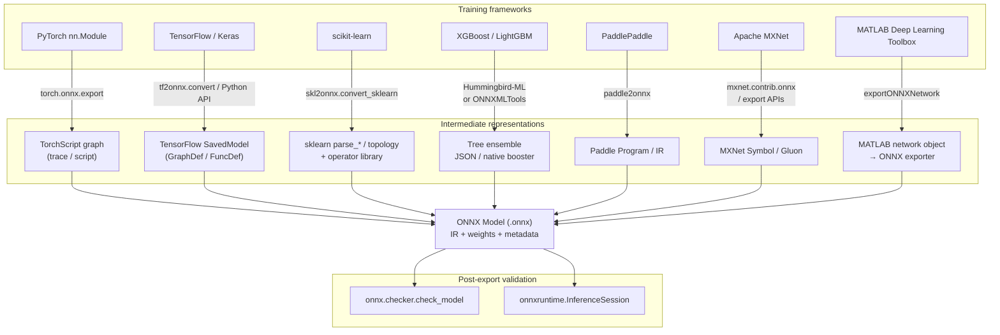

# Export pipeline (all paths → ONNX)

This diagram summarizes major **framework-to-ONNX** export routes taught in Chapter 5. Arrow labels name the **typical converter or API**. Exact package names and supported opsets evolve; always check the upstream project for your version.

## How to read this diagram

- **PyTorch** usually goes through a **TorchScript** representation (trace or script) produced internally during export; you normally call one API: `torch.onnx.export`.
- **TensorFlow** conversion typically starts from a **SavedModel** (or a frozen graph in older workflows); **`tf2onnx`** is the mainstream open-source path today.
- **scikit-learn** conversion is **declarative**: parsers walk estimator types and emit ONNX nodes from **`skl2onnx`**’s operator mapping tables.
- **Tree ensembles** can be converted via **ONNXMLTools** (native tree → ONNX operators) or **Hummingbird** (compile to tensor pipelines → torch → ONNX in some workflows).
- **All paths** should converge on the same **deployment gate**: structural checking plus **runtime parity** tests.

---

*Return to [Chapter 5 README](../README.md)*
