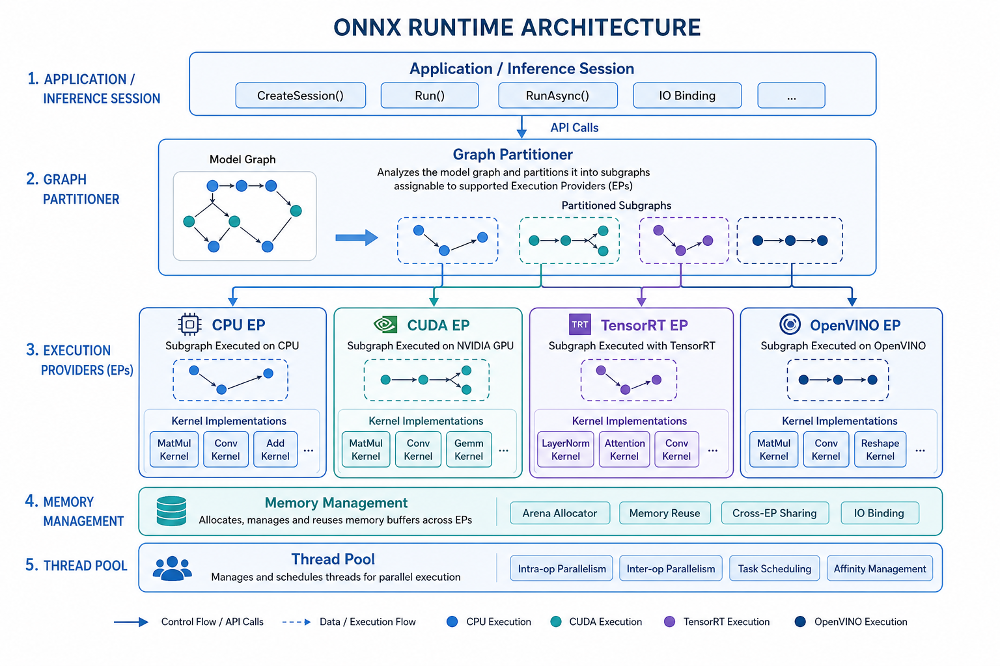

# ORT Architecture

> **Interview Relevance:** HIGH — Understanding ORT's optimization → partitioning → execution pipeline is essential for any ML deployment role. Interviewers test whether you understand *why* inference is fast, not just how to call `session.run()`.

---

## Visual Overview

See `assets/` for architecture diagrams. Refer to `../diagrams/ort_architecture.md` for Mermaid-based visualization.

## Why (Motivation)
ONNX Runtime is the reference inference engine for ONNX models. Understanding its architecture lets you reason about **latency**, **memory**, and **hardware utilization** instead of treating inference as a black box. It powers production systems from Azure to edge devices.

## When (Use Cases)
- Deploying ONNX models to production (cloud, edge, mobile)
- Debugging unexpected latency or provider fallback
- Choosing between ORT, TensorRT, OpenVINO, or TVM
- Optimizing inference for specific hardware targets

## How (Mechanism)
ORT processes an ONNX graph through three stages: **Graph Optimization** (rewrites for efficiency), **Partitioning** (assigning nodes to Execution Providers by priority), and **Execution** (running kernels with managed memory and thread pools). The session lifecycle—load → optimize → plan → run—front-loads expensive work at creation time so each `run()` is fast.

---

## Prerequisites
- [ONNX Operators and OpSets](../../Chapter_04_ONNX_Operators_and_OpSets/)
- [Exporting Models to ONNX](../../Chapter_05_Exporting_Models_to_ONNX/)

## What You Will Learn

| Concept | Why It Matters | Interview Frequency |
|---------|---------------|:-------------------:|
| Three-layer pipeline (optimize → partition → execute) | Core mental model for all ORT behavior | ⭐⭐⭐ |
| Execution Provider partitioning | Explains why some ops land on CPU even with GPU EP | ⭐⭐⭐ |
| Memory management & allocators | Key to understanding OOM and latency spikes | ⭐⭐ |
| Threading (intra-op vs inter-op) | Critical tuning knob; commonly confused | ⭐⭐⭐ |
| Session lifecycle | Explains warm-up costs and session reuse patterns | ⭐⭐ |
| ORT vs TensorRT / OpenVINO / TVM | Architecture decision interviews | ⭐⭐⭐ |

## Key Interview Questions Answered Here
1. **How does ORT decide which EP runs each node?** → Priority-ordered EP list; each EP claims nodes it supports, unclaimed nodes fall through to CPU.
2. **What is the difference between intra-op and inter-op threading?** → Intra-op parallelizes within a single op (e.g., MatMul tiles); inter-op parallelizes across independent ops in the graph.
3. **Why is session creation expensive but `run()` cheap?** → Session creation includes graph optimization and partitioning; `run()` reuses the compiled execution plan.
4. **When would you choose ORT over TensorRT?** → ORT for multi-platform ONNX portability; TensorRT for maximum NVIDIA GPU throughput when the graph converts cleanly.

## Notebooks

| Notebook | Focus | Time |
|----------|-------|:----:|
| [ORT_Architecture_Deep_Dive.ipynb](01_ORT_Architecture_Deep_Dive.ipynb) | Theory & internals | ~20 min |
| [ORT_Architecture_Apply.ipynb](02_ORT_Architecture_Apply.ipynb) | Hands-on practice | ~15 min |

## Common Mistakes & Confusions
- Assuming "GPU EP" means **all** ops run on GPU — partitioning is per-node; some ops fall back to CPU.
- Confusing `intra_op_num_threads` (within-op parallelism) with `inter_op_num_threads` (across-op parallelism).
- Recreating `InferenceSession` per request instead of reusing it — session creation is the expensive step.
- Expecting ORT to auto-tune like a compiler — hardware-specific tuning happens inside EPs, not ORT core.

---

## Next Steps
→ [02_Execution_Providers](../02_Execution_Providers/)

---
**Author:** [Gaurav14cs17](https://github.com/Gaurav14cs17)
