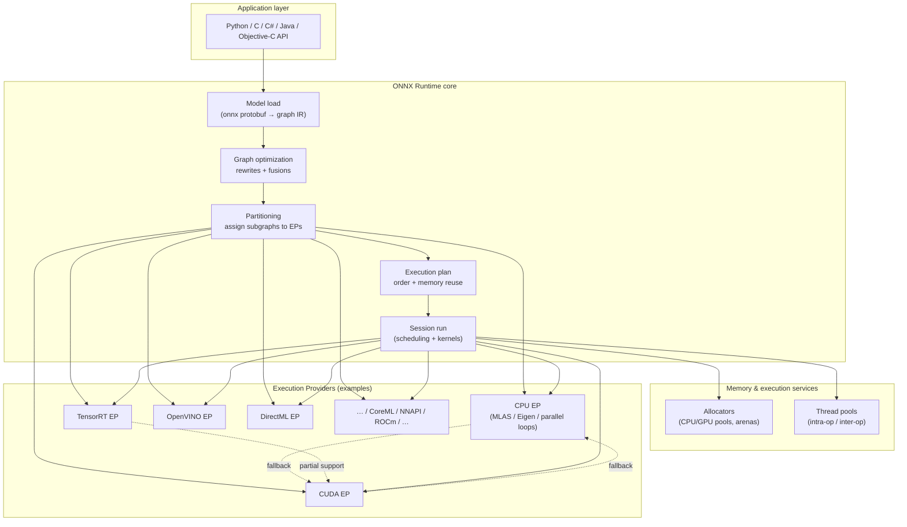

# ONNX Runtime: Architecture (Mermaid)

This diagram summarizes how an ONNX model flows through **ONNX Runtime (ORT)**, from **loading** through **optimization**, **partitioning** to **Execution Providers**, and **execution** with **allocators** and **kernels**.

> **Reading tip:** follow the numbered path for the “steady state” inference pipeline; the **fallback** edge shows what happens when a preferred EP declines a subgraph.

## Legend

| Symbol | Meaning |
|--------|---------|
| **Graph optimization** | Hardware-agnostic graph transforms (constant folding, fusion, layout planning where applicable). |
| **Partitioning** | Each ONNX node/subgraph is assigned to an EP that claims it; some EPs compile **fused** regions. |
| **Fallback** | If a node cannot run on a preferred EP, ORT may place it on another EP in the priority list. |
| **TensorRT EP nuance** | TRT may handle a fused segment while **neighboring** ops still run on CUDA or CPU. |

## Companion materials

- Narrative walkthrough: [01 — ORT Architecture](../01_ORT_Architecture/README.md)
- EP catalog: [02 — Execution Providers](../02_Execution_Providers/README.md)
