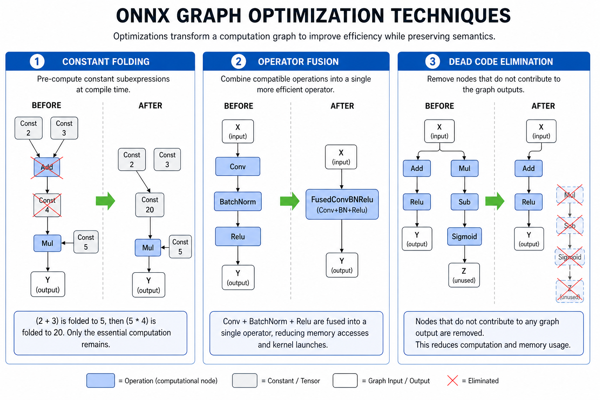

# Graph Optimizations

> **Interview Relevance:** HIGH — Graph optimization is a universal concept in ML deployment. Interviewers expect you to explain constant folding, fusion patterns (Conv+BN, MatMul+Add), and the difference between offline and runtime optimization.

---

## Visual Overview

See `assets/` for before/after fusion diagrams. Refer to `../diagrams/optimization_pipeline.md`.

## Why (Motivation)
ONNX exporters emit verbose graphs faithful to training frameworks. Graph optimization rewrites these into equivalent graphs that are faster, use less memory, and align with fused kernels. This is often the first and easiest optimization step before quantization or pruning.

## When (Use Cases)
- Reducing inference latency without changing the model architecture
- Preparing models for deployment to production runtimes
- Eliminating redundant operations from exported ONNX graphs
- As a prerequisite step before quantization

## How (Mechanism)
Three families of transforms: **Constant folding** (pre-evaluate static subgraphs), **Redundant elimination** (remove Identity, dead branches, duplicate initializers), and **Operator fusion** (replace patterns like Conv+BN+Relu with fused kernels). Applied via `onnxoptimizer` (offline) or ORT `SessionOptions` (at session creation).

---

## Prerequisites
- [07_ONNX_Runtime](../../07_ONNX_Runtime/)

## What You Will Learn

| Concept | Why It Matters | Interview Frequency |
|---------|---------------|:-------------------:|
| Constant folding | Reduces runtime computation | ⭐⭐⭐ |
| Redundant node elimination | Cleans up exporter artifacts | ⭐⭐ |
| Conv + BN fusion | Most impactful single fusion pattern | ⭐⭐⭐ |
| Conv + Relu / MatMul + Add fusion | Common in CNNs and linear layers | ⭐⭐⭐ |
| `onnxoptimizer` vs ORT graph opts | Offline vs runtime optimization | ⭐⭐ |
| Numerical validation after optimization | Prevents silent accuracy loss | ⭐⭐ |

## Key Interview Questions Answered Here
1. **What is constant folding?** → Pre-evaluating subgraphs with all-known inputs at optimization time, replacing them with precomputed constants.
2. **Explain Conv+BN fusion** → BatchNorm parameters are algebraically folded into Conv weights and bias, eliminating BN as a separate kernel.
3. **What's the difference between onnxoptimizer and ORT graph optimization?** → onnxoptimizer runs offline on the ONNX file; ORT optimizations run at session creation, tailored to the EP's kernels.
4. **How do you validate that optimization didn't change model behavior?** → Run numerical checks on representative inputs, comparing outputs before and after.

## Notebooks

| Notebook | Focus | Time |
|----------|-------|:----:|
| [Graph_Optimizations_Deep_Dive.ipynb](01_Graph_Optimizations_Deep_Dive.ipynb) | Theory & internals | ~20 min |
| [Graph_Optimizations_Apply.ipynb](02_Graph_Optimizations_Apply.ipynb) | Hands-on practice | ~15 min |

## Common Mistakes & Confusions
- Assuming all optimizations are "free" — fused kernels may assume specific EP support or tensor layouts.
- Not validating numerical equivalence after optimization — especially for floating-point reordering.
- Treating `onnxoptimizer` pass lists as stable — they are version-sensitive.
- Forgetting to run `check_model` after optimization passes.

---

## Next Steps
→ [02_Quantization_Techniques](../02_Quantization_Techniques/)

---
**Author:** [Gaurav14cs17](https://github.com/Gaurav14cs17)
