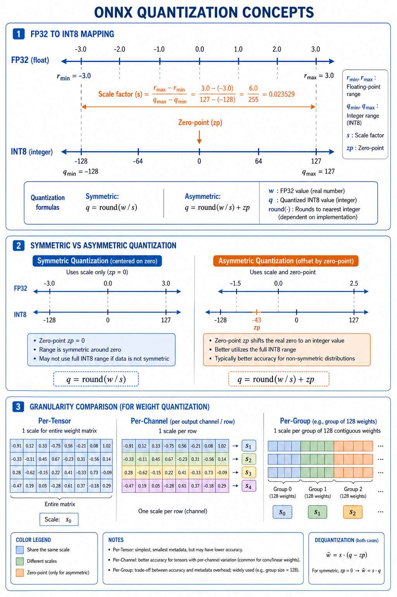

# Quantization Techniques

> **Interview Relevance:** HIGH — Quantization is the single most impactful optimization for mobile/edge deployment. Interviewers test your understanding of static vs dynamic, PTQ vs QAT, calibration, and accuracy tradeoffs.

---

## Visual Overview

See `assets/` for quantization workflow diagrams.

## Why (Motivation)
Quantization maps FP32 tensors to lower-precision types (FP16, INT8), yielding faster math, smaller models, and higher throughput on hardware with low-precision compute units. It is often the largest performance lever for CPU and mobile deployments.

## When (Use Cases)
- Deploying models to mobile/edge devices with limited memory
- Reducing inference cost on CPU servers (INT8 paths)
- Meeting strict latency SLAs that FP32 cannot satisfy
- Compressing model size for bandwidth-constrained deployments

## How (Mechanism)
Quantization chooses a finite grid of representable values and snaps tensors onto that grid using **scale** and **zero-point** parameters. **Dynamic** quantization computes ranges at runtime; **static** uses pre-collected calibration statistics. **PTQ** quantizes after training; **QAT** simulates quantization during training for better accuracy.

---

## Prerequisites
- [01_Graph_Optimizations](../01_Graph_Optimizations/)
- Basic understanding of ONNX Runtime sessions

## What You Will Learn

| Concept | Why It Matters | Interview Frequency |
|---------|---------------|:-------------------:|
| Quantization fundamentals (scale, zero-point) | Core representation theory | ⭐⭐⭐ |
| Static vs dynamic quantization | Key architectural decision | ⭐⭐⭐ |
| PTQ vs QAT | Training vs post-training tradeoffs | ⭐⭐⭐ |
| Calibration process | Required for static quantization | ⭐⭐⭐ |
| ONNX QDQ patterns | Interoperability standard | ⭐⭐ |
| Accuracy vs speed tradeoffs | Engineering decision framework | ⭐⭐⭐ |

## Key Interview Questions Answered Here
1. **What is the difference between static and dynamic quantization?** → Static pre-computes activation ranges via calibration; dynamic observes ranges per-inference. Static has lower runtime overhead but requires calibration data.
2. **When would you choose QAT over PTQ?** → When PTQ accuracy loss is unacceptable (aggressive INT8, sensitive layers), and you can afford retraining cycles.
3. **What is calibration and why does it matter?** → Calibration collects activation statistics (min/max) using representative inputs to determine optimal scale/zero-point for static quantization.
4. **What are QDQ nodes in ONNX?** → QuantizeLinear + DequantizeLinear patterns placed around compute nodes for interoperable quantized model representation.

## Notebooks

| Notebook | Focus | Time |
|----------|-------|:----:|
| [Quantization_Techniques_Deep_Dive.ipynb](01_Quantization_Techniques_Deep_Dive.ipynb) | Theory & internals | ~20 min |
| [Quantization_Techniques_Apply.ipynb](02_Quantization_Techniques_Apply.ipynb) | Hands-on practice | ~15 min |

## Common Mistakes & Confusions
- Treating quantization as "free" accuracy — always validate on task-specific metrics, not just tensor RMSE.
- Using non-representative calibration data — this leads to poor scale/zero-point choices and accuracy loss.
- Confusing static and dynamic quantization — they have very different offline cost and runtime behavior.
- Ignoring outlier-sensitive layers — first/last conv, attention softmax may need special handling.

---

## Next Steps
→ [03_Pruning_and_Sparsity](../03_Pruning_and_Sparsity/)

---
**Author:** [Gaurav14cs17](https://github.com/Gaurav14cs17)
