# Optimization pipeline (Mermaid)

This diagram summarizes a pragmatic **end-to-end optimization pipeline** from training/export through deployment. It is intended as a **roadmap**, not a mandatory linear process—teams iterate locally inside each box.

```mermaid
flowchart LR
  subgraph train_export["Train & export"]
    A[Train / fine-tune] --> B[Export ONNX]
    B --> C[Sanity inference + checker]
  end

  subgraph offline["Offline graph work"]
    C --> D[Constant folding / simplications]
    D --> E[Fusion opportunities identified]
    E --> F[Optional: onnxoptimizer passes]
  end

  subgraph numeric["Numeric compression"]
    F --> G{Need smaller / faster numerics?}
    G -->|Yes| H[Quantization: PTQ / QAT]
    G -->|No| I[Keep FP16/FP32 policy]
    H --> J[Calibration data if static PTQ]
    J --> K[Validate accuracy metrics]
    I --> K
  end

  subgraph sparsity["Optional sparsity"]
    K --> L{Need pruning?}
    L -->|yes| M[Structured / unstructured pruning]
    L -->|no| N[Skip]
    M --> O[Fine-tune / validate]
    N --> P[Continue]
    O --> P
  end

  subgraph bench_ship["Measure & ship"]
    P --> Q[ORT session + EP selection]
    Q --> R[Benchmark p50/p95 + throughput]
    R --> S{Meets SLOs?}
    S -->|no| T[Iterate: graph / quant / threads]
    T --> Q
    S -->|yes| U[Package model + runtime config]
  end
```

---

## Reading tips

- **Calibration** is on the hot path for **static** quantization—not necessarily for **dynamic** approaches.
- **Pruning** without kernel support may improve **ZIP size** more than **latency**.
- **EP selection** (CPU vs CUDA vs vendor) is effectively a **re-optimization** of the execution plan—re-benchmark when EPs change.

---

## See also

- Chapter 7 overview: [../README.md](../README.md)
