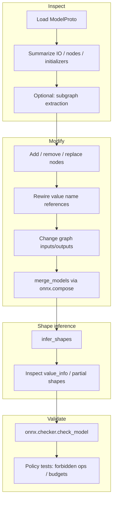

# Graph manipulation map (Mermaid)

This diagram summarizes the **graph manipulation operations** covered in Chapter 8 and how they connect to validation and deployment.

---

## Notes

- **Merge** is powerful but is the most common place for **name collisions**—use **`prefix`** utilities when needed.
- **Shape inference** is best viewed as **informational** for fully dynamic graphs—still invaluable for catching mistakes.

---

## See also

- [../README.md](../README.md)
