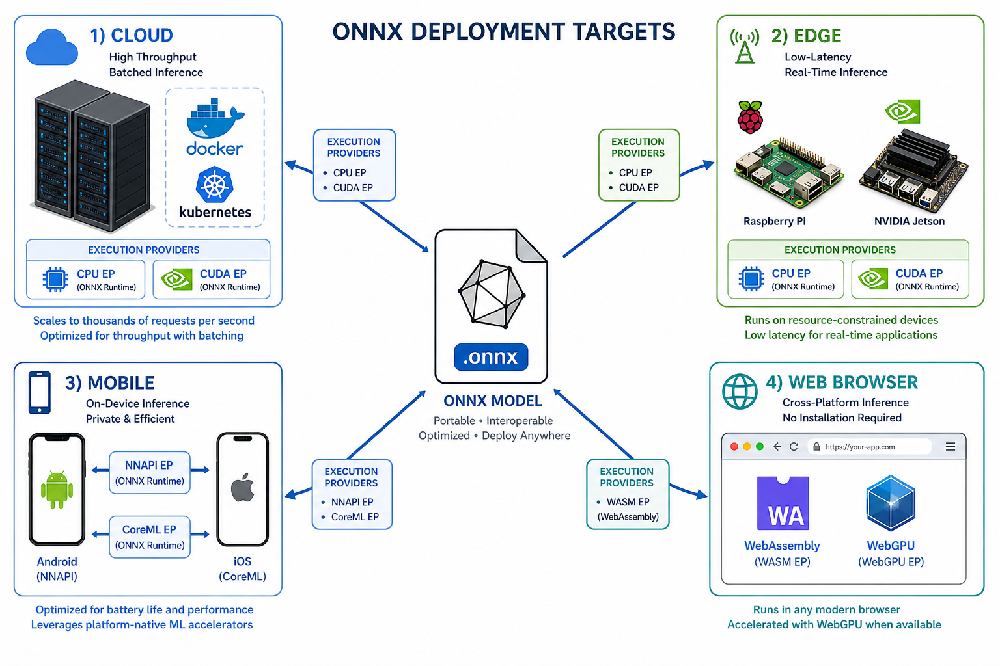

# Edge Deployment with ONNX Runtime

> **Interview Relevance:** HIGH — Edge ML deployment is a growing interview topic as IoT and on-device inference become industry-standard; expect questions on latency budgets, quantization trade-offs, and hardware-aware optimization.

---

## Visual Overview


```
Sensor -> [capture] -> [preprocess] -> [ORT inference] -> [postprocess] -> [actuate / MQTT / local UI]
```

```
                        +-----------------------------+
   Sensors / cameras -->| Edge gateway / IPC / robot  |
                        |  +------------------------+ |
                        |  | Preprocess (resize,norm)| |
                        |  +-----------+------------+ |
                        |              v              |
                        |  +------------------------+ |
                        |  | ONNX Runtime session   | |
                        |  |  - SessionOptions      | |
                        |  |  - IOBinding (optional) | |
                        |  +-----------+------------+ |
                        |              v              |
                        |  +------------------------+ |
                        |  | Postprocess (thr,NMS)  | |
                        |  +-----------+------------+ |
                        |              v              |
   Actuators / UI <-----|  Local decision + MQTT    |
                        +-------------+-------------+
                                      |
                                      |  optional: filtered events only
                                      v
                            (Cloud analytics / training)
```

## Why (Motivation)

Edge computing places inference **close to sensors and actuators**—inside factories, vehicles, retail stores, and home gateways. This avoids network round-trips, preserves privacy, reduces bandwidth costs, and enables autonomous operation even when connectivity is unreliable. ONNX Runtime's cross-platform design makes it ideal for deploying the same model artifact across diverse edge hardware.

## When (Use Cases)

- **Real-time industrial inspection** on factory floors with sub-second latency requirements
- **Autonomous vehicles** needing on-device perception without cloud dependency
- **Smart cameras** in retail/security with privacy constraints (data stays on-prem)
- **Agricultural drones** operating in areas without reliable connectivity
- **Home automation** gateways running local voice/vision models

## How (Mechanism)

Edge deployment pairs an ONNX model with a device-specific ORT build that includes the right Execution Providers (CPU EP with ARM Neon, CUDA/TensorRT on Jetson, OpenVINO on Intel). The model is optimized via graph optimizations, quantization (INT8/FP16), and architecture-appropriate input resolution to fit within the device's CPU/RAM/power budget. Pre/postprocessing must exactly match training to prevent drift.

---

## Prerequisites
- [09_ONNX_Graph_Manipulation](../../09_ONNX_Graph_Manipulation/) — Understanding graph optimizations
- [08_Model_Optimization_and_Quantization](../../08_Model_Optimization_and_Quantization/) — Quantization techniques

## What You Will Learn

| Concept | Why It Matters | Interview Frequency |
|---------|---------------|:-------------------:|
| Edge vs cloud trade-offs | Foundation for deployment architecture decisions | ⭐⭐⭐ |
| ORT Execution Providers on ARM/Jetson/Intel | Hardware-aware inference is a key differentiator | ⭐⭐⭐ |
| Raspberry Pi deployment | Most common entry-level edge platform | ⭐⭐ |
| NVIDIA Jetson setup (CUDA/TensorRT EP) | Industry-standard for GPU-accelerated edge | ⭐⭐⭐ |
| Intel NCS2 / OpenVINO integration | Enterprise edge acceleration ecosystem | ⭐⭐ |
| Model optimization for constrained devices | Critical for production edge workloads | ⭐⭐⭐ |
| IOBinding for streaming pipelines | Advanced technique for GPU/camera workflows | ⭐⭐ |

## Key Interview Questions Answered Here

1. **Why can't you just use cloud patterns on edge devices?** → Edge workloads are small-batch, streaming, memory-bound; cloud patterns (large batches, autoscaling pools) break on constrained hardware.
2. **How does ORT select Execution Providers on edge hardware?** → ORT iterates left-to-right through the provider list, delegating supported subgraphs; unsupported ops fall back to CPU EP.
3. **What's the optimization order for edge models?** → Export sanity → Graph cleanup → ORT graph optimizations → Precision reduction (FP16/INT8) → Architecture swap (e.g., MobileNet).
4. **How do you handle pre/post-processing parity on edge?** → Freeze normalization constants, pin input resolution, use golden-vector parity tests comparing edge vs training outputs.

## Notebooks

| Notebook | Focus | Time |
|----------|-------|:----:|
| [Edge_Deployment_Deep_Dive.ipynb](01_Edge_Deployment_Deep_Dive.ipynb) | Theory & internals | ~20 min |
| [Edge_Deployment_Apply.ipynb](02_Edge_Deployment_Apply.ipynb) | Hands-on practice | ~15 min |

## Common Mistakes & Confusions

- **Assuming laptop benchmarks predict edge performance** — Thermal throttling, ARM memory bandwidth, and OS scheduling differ dramatically on Pi/Jetson.
- **Forgetting pre/postprocessing parity** — Most production edge bugs come from training/serving skew in normalization or channel ordering (RGB vs BGR).
- **Using FP32 when INT8 suffices** — On CPU-only edge devices, INT8 can deliver 2-4x speedup with acceptable accuracy loss.
- **Ignoring thermal soak tests** — Sustained inference loads cause clock throttling that micro-benchmarks miss.
- **Not pinning ORT + model versions** — Wheel mismatches on aarch64 are common; freeze versions per architecture image.

---

## Next Steps
→ [02_Cloud_Deployment](../02_Cloud_Deployment/)

---
**Author:** [Gaurav14cs17](https://github.com/Gaurav14cs17)
