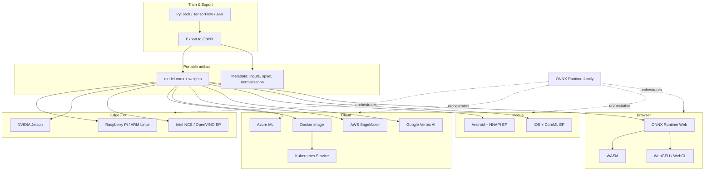

# Deployment overview (Chapter 9)

This diagram situates **ONNX** as a portable artifact that can be executed across **edge**, **cloud**, **mobile**, and **web** stacks using **ONNX Runtime** family products and appropriate **Execution Providers (EPs)**.

---

## Reading guide

- **Solid lines** show the **model artifact** flowing into each platform.
- **Dotted lines** emphasize that **ONNX Runtime** (including mobile/web variants) is the common execution layer—actual EP availability depends on **device**, **build**, and **graph operators**.
