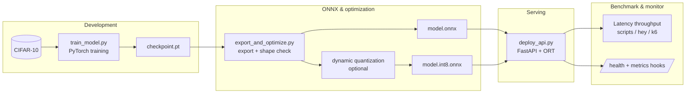

# End-to-end image classification pipeline

This diagram summarizes the **Chapter 10** project flow: train in PyTorch, export to ONNX, optimize/quantize for deployment constraints, serve over HTTP, then benchmark and monitor.

**Reading notes**

- The arrow from **checkpoint** to **export** implies you must **freeze architecture** and **weights** reproducibly; avoid “mystery” checkpoints without commit hashes.
- **Quantization** produces a separate artifact—version both and evaluate accuracy deltas.
