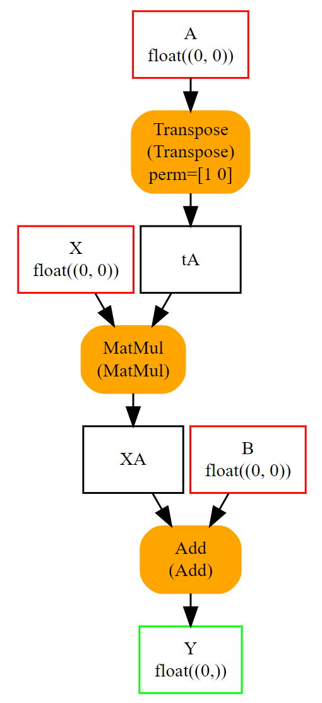
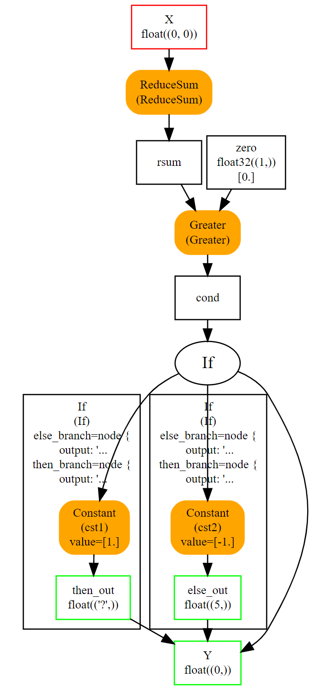
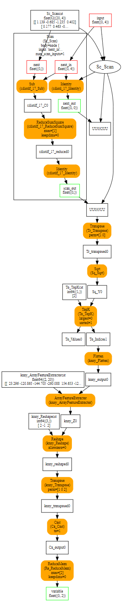
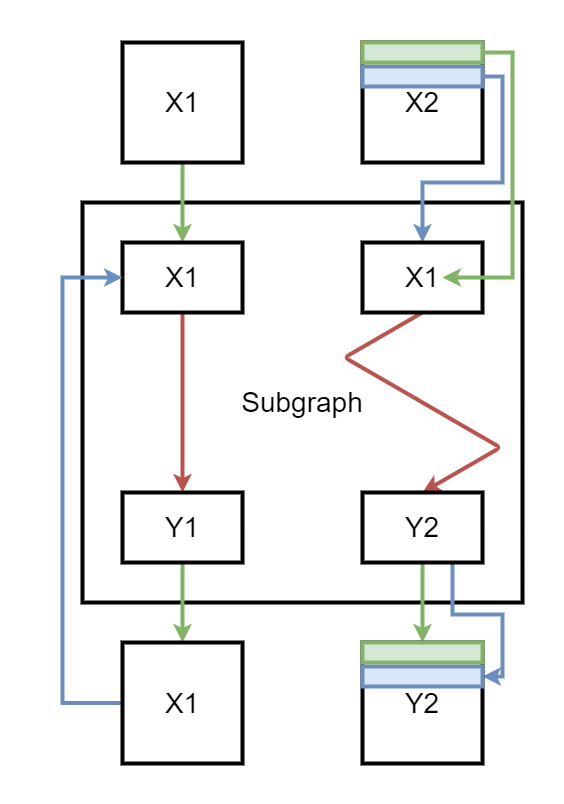

# ONNX Tutorial — The Complete Guide

```
  ┌─────────────────────────────────────────────────────────────────────┐
  │                                                                     │
  │     ██████╗ ███╗   ██╗███╗   ██╗██╗  ██╗                           │
  │    ██╔═══██╗████╗  ██║████╗  ██║╚██╗██╔╝                           │
  │    ██║   ██║██╔██╗ ██║██╔██╗ ██║ ╚███╔╝                            │
  │    ██║   ██║██║╚██╗██║██║╚██╗██║ ██╔██╗                            │
  │    ╚██████╔╝██║ ╚████║██║ ╚████║██╔╝ ██╗                           │
  │     ╚═════╝ ╚═╝  ╚═══╝╚═╝  ╚═══╝╚═╝  ╚═╝                         │
  │                                                                     │
  │           Open Neural Network Exchange — Complete Tutorial          │
  │                                                                     │
  └─────────────────────────────────────────────────────────────────────┘
```

<p align="center">
  <em>A comprehensive, hands-on curriculum covering everything you need to know about ONNX — from fundamentals to production deployment.</em>
</p>

<p align="center">
  <a href="#-learning-path">Learning Path</a> •
  <a href="#-table-of-contents">Table of Contents</a> •
  <a href="#-quick-start">Quick Start</a> •
  <a href="#-prerequisites">Prerequisites</a>
</p>

---

## What This Repository Is

This is an **11-section deep dive** into the ONNX ecosystem, structured as a progressive curriculum from your first ONNX graph all the way to production deployment. Each section is a self-contained folder with detailed READMEs, runnable notebooks (`Deep_Dive.ipynb` + `Apply.ipynb`), and supporting diagrams. **Official diagrams from [onnx.ai](https://onnx.ai)** are included for visual clarity.

| | **Foundations (01–04)** | **Core Skills (05–08)** | **Applied (09–11)** |
|---|---|---|---|
| **Focus** | What ONNX is, how it works internally, its format and spec | Building, exporting, running, and optimizing models | Manipulating graphs, deploying everywhere, real-world projects |
| **Sections** | 4 | 4 | 3 |
| **Approach** | Theory + diagrams → hands-on code → build intuition | Framework walkthroughs → runtime mastery → optimization | Graph surgery → multi-platform deploy → end-to-end capstone |

---

## 🗺️ Learning Path

```
┌──────────────────────────────────────────────────────────────────────────┐
│                                                                          │
│  FOUNDATION (sequential)                                                 │
│                                                                          │
│  ①  ONNX with Python (Quick Start)                                      │
│       ↓                                                                  │
│  ②  Introduction to ONNX                                                │
│       ↓                                                                  │
│  ③  Architecture & Internals                                            │
│       ↓                                                                  │
│  ④  Model Format & Protobuf                                             │
│                                                                          │
├──────────────────────────────────────────────────────────────────────────┤
│                                                                          │
│  CORE SKILLS (sequential, after ④)                                      │
│                                                                          │
│  ⑤  Operators & OpSets                                                  │
│       ↓                                                                  │
│  ⑥  Exporting Models to ONNX                                           │
│       ↓                                                                  │
│  ⑦  ONNX Runtime (ORT)                                                 │
│       ↓                                                                  │
│  ⑧  Model Optimization & Quantization                                  │
│                                                                          │
├──────────────────────────────────────────────────────────────────────────┤
│                                                                          │
│  APPLIED (independent after foundation, any order)                       │
│                                                                          │
│  ┌────────────────┐  ┌────────────────┐  ┌──────────────────────────┐   │
│  │ ⑨ Graph        │  │ ⑩ Deployment   │  │ ⑪ Advanced Topics       │   │
│  │   Manipulation │  │                │  │   & Projects            │   │
│  └────────────────┘  └────────────────┘  └──────────────────────────┘   │
│                                                                          │
└──────────────────────────────────────────────────────────────────────────┘
```

**Recommended order:** Start with **①–④** sequentially to build a solid foundation, then work through **⑤–⑧** for core ONNX skills. Sections **⑨–⑪** can be explored independently once you have the foundation.

---

## 📚 Table of Contents

### [① ONNX with Python — Quick Start](01_ONNX_with_Python/)

> Build, serialize, and run ONNX models using the Python API. Includes official onnx.ai diagrams.

| # | Topic | What You'll Learn |
|:-:|-------|-------------------|
| 1.1 | [Linear Regression Example](01_ONNX_with_Python/01_Linear_Regression_Example/) | Build your first ONNX graph — `Y = XA + B` with MatMul & Add |
| 1.2 | [Serialization](01_ONNX_with_Python/02_Serialization/) | Save and load ONNX models to/from disk |
| 1.3 | [Initializers & Attributes](01_ONNX_with_Python/03_Initializers_and_Attributes/) | Constants stored in the model and operator parameters |
| 1.4 | [Opset & Metadata](01_ONNX_with_Python/04_Opset_and_Metadata/) | Versioning and model metadata |
| 1.5 | [Subgraphs: If, Scan, Loop](01_ONNX_with_Python/05_Subgraphs_Tests_Loops/) | Control flow operators |
| 1.6 | [Functions](01_ONNX_with_Python/06_Functions/) | Reusable operator combinations |
| 1.7 | [Parsing & Checker](01_ONNX_with_Python/07_Parsing_and_Checker/) | Validation and shape inference |
| 1.8 | [Evaluation & Runtime](01_ONNX_with_Python/08_Evaluation_and_Runtime/) | Run inference, debug, and benchmark |

### [② Introduction to ONNX](02_Introduction_to_ONNX/)

> History, motivation, ecosystem, and environment setup.

| # | Topic | What You'll Learn |
|:-:|-------|-------------------|
| 2.1 | [What is ONNX](02_Introduction_to_ONNX/01_What_is_ONNX/) | History, origin, and the interoperability problem |
| 2.2 | [Why ONNX Matters](02_Introduction_to_ONNX/02_Why_ONNX_Matters/) | The N×M problem, benefits, industry adoption |
| 2.3 | [ONNX Ecosystem Overview](02_Introduction_to_ONNX/03_ONNX_Ecosystem_Overview/) | Model Zoo, converters, tools, partners |
| 2.4 | [Installation and Setup](02_Introduction_to_ONNX/04_Installation_and_Setup/) | Python env, packages, verification |

### [③ ONNX Architecture and Internals](03_ONNX_Architecture_and_Internals/)

> Computation graphs, node anatomy, the IR specification, and the type system.

| # | Topic | What You'll Learn |
|:-:|-------|-------------------|
| 3.1 | [Computation Graph Basics](03_ONNX_Architecture_and_Internals/01_Computation_Graph_Basics/) | DAGs, nodes, edges, forward pass |
| 3.2 | [Nodes, Edges, and Tensors](03_ONNX_Architecture_and_Internals/02_Nodes_Edges_and_Tensors/) | Node anatomy, data types, inspection |
| 3.3 | [ONNX IR Specification](03_ONNX_Architecture_and_Internals/03_ONNX_IR_Specification/) | Proto hierarchy, attributes, sub-graphs |
| 3.4 | [Type System and Shapes](03_ONNX_Architecture_and_Internals/04_Type_System_and_Shapes/) | Types, shape inference, symbolic dims |

### [④ ONNX Model Format and Protocol Buffers](04_ONNX_Model_Format_and_Protobuf/)

> Protocol Buffers primer and the ONNX `.onnx` file format in depth.

| # | Topic | What You'll Learn |
|:-:|-------|-------------------|
| 4.1 | [Protobuf Primer](04_ONNX_Model_Format_and_Protobuf/01_Protobuf_Primer/) | Serialization basics, `.proto` syntax |
| 4.2 | [ONNX Proto Structure](04_ONNX_Model_Format_and_Protobuf/02_ONNX_Proto_Structure/) | ModelProto, GraphProto, NodeProto deep dive |
| 4.3 | [Reading and Writing Models](04_ONNX_Model_Format_and_Protobuf/03_Reading_and_Writing_Models/) | Load, save, external data, large models |
| 4.4 | [Model Metadata and Versioning](04_ONNX_Model_Format_and_Protobuf/04_Model_Metadata_and_Versioning/) | IR versions, OpSet versions, metadata |

### [⑤ ONNX Operators and OpSets](05_ONNX_Operators_and_OpSets/)

> The operator catalog, versioning system, custom ops, and schemas.

| # | Topic | What You'll Learn |
|:-:|-------|-------------------|
| 5.1 | [Standard Operators](05_ONNX_Operators_and_OpSets/01_Standard_Operators/) | 35+ operators, categories, deep dives |
| 5.2 | [OpSet Versions](05_ONNX_Operators_and_OpSets/02_OpSet_Versions/) | Versioning, domains, compatibility |
| 5.3 | [Custom Operators](05_ONNX_Operators_and_OpSets/03_Custom_Operators/) | Creating and registering custom ops |
| 5.4 | [Operator Schemas](05_ONNX_Operators_and_OpSets/04_Operator_Schemas/) | Schema components, type constraints |

### [⑥ Exporting Models to ONNX](06_Exporting_Models_to_ONNX/)

> Convert models from every major framework into ONNX format.

| # | Topic | What You'll Learn |
|:-:|-------|-------------------|
| 6.1 | [PyTorch to ONNX](06_Exporting_Models_to_ONNX/01_PyTorch_to_ONNX/) | `torch.onnx.export`, tracing vs scripting |
| 6.2 | [TensorFlow/Keras to ONNX](06_Exporting_Models_to_ONNX/02_TensorFlow_Keras_to_ONNX/) | `tf2onnx`, SavedModel, H5 |
| 6.3 | [Scikit-Learn to ONNX](06_Exporting_Models_to_ONNX/03_Scikit_Learn_to_ONNX/) | `skl2onnx`, pipelines, custom converters |
| 6.4 | [Other Frameworks](06_Exporting_Models_to_ONNX/04_Other_Frameworks/) | XGBoost, LightGBM, PaddlePaddle, MXNet |

### [⑦ ONNX Runtime (ORT)](07_ONNX_Runtime/)

> Architecture, execution providers, inference sessions, and performance tuning.

| # | Topic | What You'll Learn |
|:-:|-------|-------------------|
| 7.1 | [ORT Architecture](07_ONNX_Runtime/01_ORT_Architecture/) | Layers, partitioner, memory, threading |
| 7.2 | [Execution Providers](07_ONNX_Runtime/02_Execution_Providers/) | CPU, CUDA, TensorRT, OpenVINO, and more |
| 7.3 | [Inference Sessions](07_ONNX_Runtime/03_Inference_Sessions/) | Session config, IOBinding, batch inference |
| 7.4 | [Performance Tuning](07_ONNX_Runtime/04_Performance_Tuning/) | Profiling, threading, optimization levels |

### [⑧ Model Optimization and Quantization](08_Model_Optimization_and_Quantization/)

> Graph-level optimizations, quantization, pruning, and benchmarking.

| # | Topic | What You'll Learn |
|:-:|-------|-------------------|
| 8.1 | [Graph Optimizations](08_Model_Optimization_and_Quantization/01_Graph_Optimizations/) | Constant folding, fusion, dead code removal |
| 8.2 | [Quantization Techniques](08_Model_Optimization_and_Quantization/02_Quantization_Techniques/) | Static, dynamic, QAT vs PTQ |
| 8.3 | [Pruning and Sparsity](08_Model_Optimization_and_Quantization/03_Pruning_and_Sparsity/) | Structured, unstructured, sparse tensors |
| 8.4 | [Benchmarking](08_Model_Optimization_and_Quantization/04_Benchmarking/) | Methodology, metrics, profiling scripts |

### [⑨ ONNX Graph Manipulation](09_ONNX_Graph_Manipulation/)

> Inspect, modify, validate, and perform shape inference on ONNX graphs.

| # | Topic | What You'll Learn |
|:-:|-------|-------------------|
| 9.1 | [Inspecting Models](09_ONNX_Graph_Manipulation/01_Inspecting_Models/) | Netron, programmatic inspection |
| 9.2 | [Modifying Graphs](09_ONNX_Graph_Manipulation/02_Modifying_Graphs/) | Add/remove nodes, merging models |
| 9.3 | [Shape Inference](09_ONNX_Graph_Manipulation/03_Shape_Inference/) | Propagation, dynamic shapes |
| 9.4 | [Model Validation](09_ONNX_Graph_Manipulation/04_Model_Validation/) | `onnx.checker`, conformance testing |

### [⑩ Deployment](10_Deployment/)

> Deploy ONNX models to edge, cloud, mobile, and web.

| # | Topic | What You'll Learn |
|:-:|-------|-------------------|
| 10.1 | [Edge Deployment](10_Deployment/01_Edge_Deployment/) | Raspberry Pi, Jetson, IoT |
| 10.2 | [Cloud Deployment](10_Deployment/02_Cloud_Deployment/) | Docker, Kubernetes, AWS/Azure/GCP |
| 10.3 | [Mobile Deployment](10_Deployment/03_Mobile_Deployment/) | Android (NNAPI), iOS (CoreML) |
| 10.4 | [Web Deployment](10_Deployment/04_Web_Deployment_ONNX_JS/) | ONNX Runtime Web, WASM, WebGPU |

### [⑪ Advanced Topics and Real-World Projects](11_Advanced_Topics_and_Projects/)

> Domain-specific applications and a full end-to-end capstone project.

| # | Topic | What You'll Learn |
|:-:|-------|-------------------|
| 11.1 | [ONNX for NLP](11_Advanced_Topics_and_Projects/01_ONNX_for_NLP/) | Transformers, BERT, Hugging Face Optimum |
| 11.2 | [ONNX for Computer Vision](11_Advanced_Topics_and_Projects/02_ONNX_for_Computer_Vision/) | Classification, detection, segmentation |
| 11.3 | [ONNX for Generative AI](11_Advanced_Topics_and_Projects/03_ONNX_for_Generative_AI/) | Stable Diffusion, LLMs, audio models |
| 11.4 | [End-to-End Project](11_Advanced_Topics_and_Projects/04_End_to_End_Project/) | Train → Export → Optimize → Deploy API |

---

## 🚀 Quick Start

### 1. Set Up Environment

```bash
python -m venv onnx_env
source onnx_env/bin/activate   # Linux/macOS
pip install -r requirements.txt
```

### 2. Verify Installation

```bash
python 02_Introduction_to_ONNX/04_Installation_and_Setup/verify_installation.py
```

### 3. Follow the Learning Path

Start with **Section 01** (ONNX with Python) for a hands-on quick start, then progress through the foundation (**02–04**), core skills (**05–08**), and applied sections (**09–11**).

---

## 📋 Prerequisites

| Requirement | Minimum |
|------------|---------|
| Python | 3.8+ |
| pip | Latest |
| OS | Linux, macOS, or Windows |
| GPU (optional) | CUDA 11.x+ for GPU acceleration |
| RAM | 8 GB+ recommended |

---

## 📖 Per-Topic Structure

Every topic folder follows a consistent layout:

```
XX_Topic_Name/
├── README.md              ← Concept overview, key ideas, quick reference
├── Deep_Dive.ipynb        ← Theory + math → from-scratch code → visualizations
├── Apply.ipynb            ← Apply concepts to real models, measure results
└── assets/                ← Diagrams, images, and figures
```

| Part | Filename | What's Inside |
|------|----------|---------------|
| **Overview** | `README.md` | Concept summary, key definitions, links to further reading |
| **Deep Dive** | `Deep_Dive.ipynb` | Full theory, derivations, from-scratch implementations, visualizations |
| **Apply** | `Apply.ipynb` | Hands-on exercises applying concepts to real ONNX models |

---

## 🎯 Who This Tutorial Is For

- **ML Engineers** looking to deploy models across different platforms
- **Data Scientists** who want to optimize model inference
- **Software Engineers** building ML-powered applications
- **Students** learning about ML model interoperability and deployment
- **DevOps/MLOps Engineers** managing ML model serving infrastructure

---

## Official ONNX Diagrams (from onnx.ai)

This tutorial includes **6 official diagrams** downloaded from the ONNX documentation
at [onnx.ai/onnx/intro/python.html](https://onnx.ai/onnx/intro/python.html):

| # | Diagram | Description | Used In |
|---|---------|-------------|---------|
| 1 |  | **Linear Regression** — `Y = XA + B` with MatMul & Add | §1.1, §3.1, §4.2, §9.1 |
| 2 |  | **With Initializers** — Constants stored in the model | §1.3, §3.1, §4.3 |
| 3 |  | **Operator Attributes** — Transpose with `perm=[1,0]` | §1.3, §3.2, §5.1 |
| 4 |  | **If Operator** — Conditional branching subgraph | §1.5, §3.3 |
| 5 |  | **Scan Operator** — KNN regression with loop | §1.5, §3.3, §9.1 |
| 6 |  | **Scan Mechanism** — Iteration flow (green=1st, blue=2nd) | §1.5, §3.3 |

> Master copies live in `assets/diagrams/official_onnx_docs/`. Each diagram is also placed directly inside the section folder where it's referenced, so images render correctly when browsing any section individually.

---

## How ONNX Works — The Big Picture

```
  ┌─────────────────────────────────────────────────────────────────────────┐
  │                         TRAINING FRAMEWORKS                            │
  │                                                                         │
  │   ┌──────────┐  ┌────────────┐  ┌───────────┐  ┌──────────┐           │
  │   │ PyTorch  │  │ TensorFlow │  │  Sklearn  │  │ XGBoost  │  ...      │
  │   └────┬─────┘  └─────┬──────┘  └─────┬─────┘  └────┬─────┘           │
  │        │               │               │              │                 │
  │        ▼               ▼               ▼              ▼                 │
  │   ┌──────────┐  ┌────────────┐  ┌───────────┐  ┌──────────┐           │
  │   │torch.onnx│  │  tf2onnx   │  │ skl2onnx  │  │onnxmltools│          │
  │   │ .export()│  │            │  │           │  │          │           │
  │   └────┬─────┘  └─────┬──────┘  └─────┬─────┘  └────┬─────┘           │
  └────────┼───────────────┼───────────────┼──────────────┼─────────────────┘
           │               │               │              │
           ▼               ▼               ▼              ▼
  ┌─────────────────────────────────────────────────────────────────────────┐
  │                                                                         │
  │                        ╔═══════════════════╗                            │
  │                        ║    ONNX FORMAT    ║                            │
  │                        ║  (.onnx model)    ║                            │
  │                        ║                   ║                            │
  │                        ║  ┌─────────────┐  ║                            │
  │                        ║  │ ModelProto   │  ║                            │
  │                        ║  │ ├─GraphProto │  ║                            │
  │                        ║  │ │ ├─Nodes    │  ║                            │
  │                        ║  │ │ ├─Tensors  │  ║                            │
  │                        ║  │ │ └─Edges    │  ║                            │
  │                        ║  └─────────────┘  ║                            │
  │                        ╚═══════╤═══════════╝                            │
  │                                │                                        │
  │                    ┌───────────┼───────────┐                            │
  │                    │  Optimize & Quantize  │                            │
  │                    └───────────┬───────────┘                            │
  │                                │                                        │
  └────────────────────────────────┼────────────────────────────────────────┘
                                   │
           ┌───────────┬───────────┼───────────┬───────────┐
           ▼           ▼           ▼           ▼           ▼
  ┌─────────────────────────────────────────────────────────────────────────┐
  │                       INFERENCE RUNTIMES                                │
  │                                                                         │
  │   ┌──────────┐  ┌──────────┐  ┌──────────┐  ┌──────────┐  ┌────────┐ │
  │   │   ORT    │  │ TensorRT │  │ OpenVINO │  │  CoreML  │  │ONNX.js │ │
  │   │  (CPU)   │  │  (NVIDIA)│  │  (Intel) │  │  (Apple) │  │ (Web)  │ │
  │   └──────────┘  └──────────┘  └──────────┘  └──────────┘  └────────┘ │
  │                                                                         │
  │   ┌──────────┐  ┌──────────┐  ┌──────────┐  ┌──────────┐             │
  │   │  Cloud   │  │   Edge   │  │  Mobile  │  │  Browser │             │
  │   │ Servers  │  │ Devices  │  │  Phones  │  │          │             │
  │   └──────────┘  └──────────┘  └──────────┘  └──────────┘             │
  └─────────────────────────────────────────────────────────────────────────┘
```

---

## About the Author

```
  ┌─────────────────────────────────────────────────────────────┐
  │                                                             │
  │   Gaurav Goswami                                            │
  │   Machine Learning Engineer @ Red Hat                       │
  │   Ex-Lead Deep Learning Engineer @ Samsung R&D India        │
  │                                                             │
  └─────────────────────────────────────────────────────────────┘
```

**Gaurav Goswami** is a Machine Learning Engineer at **Red Hat**, where he contributes to the PyTorch ecosystem, open-source AI infrastructure, and high-throughput LLM inference with **vLLM**. Previously, he served as Lead Deep Learning Engineer at **Samsung R&D Institute India-Bangalore**.

### Expertise

| Domain | Technologies |
|--------|-------------|
| **AI Infrastructure** | Open-source AI tooling, scalable training pipelines, Training Hub |
| **Model Optimization** | ONNX, CUDA kernels, LLM optimization, quantization |
| **Deep Learning** | PyTorch ecosystem, Transformers, Attention mechanisms |
| **Inference & Serving** | vLLM, high-throughput inference, model deployment |
| **Generative AI** | Diffusion models, Vision-Language models, LLMs |
| **Computer Vision** | Object detection (YOLO), image segmentation, recognition |

### Connect

| Platform | Link |
|----------|------|
| GitHub | [github.com/Gaurav14cs17](https://github.com/Gaurav14cs17) |
| LinkedIn | [linkedin.com/in/gaurav14cs17](https://www.linkedin.com/in/gaurav14cs17/) |

### Notable Open-Source Work

- **[DSA](https://github.com/Gaurav14cs17/DSA)** — Data Structures & Algorithms repository (170+ stars)
- **[YOLOE](https://github.com/Gaurav14cs17/YOLOE)** — PP-YOLOE object detection (53+ stars)
- **[YOLOv8-RepNeXt](https://github.com/Gaurav14cs17/YOLOv8-RepNeXt)** — YOLOv8 with RepNeXt for efficient inference
- **[Attention Mechanisms](https://github.com/Gaurav14cs17/Attention_mechanisms)** — Surveys on efficient transformer architectures
- **[ML Researcher Foundations](https://github.com/Gaurav14cs17/ml-researcher-foundations)** — End-to-end ML researcher roadmap
- **1900+ competitive programming problems solved** across LeetCode, Codeforces, CodeChef

---

## License

This tutorial is provided for educational purposes. ONNX is an open-source project under the Apache 2.0 License.

---

<p align="center">
  <b>Made with dedication by <a href="https://github.com/Gaurav14cs17">Gaurav Goswami</a></b><br>
  MLE @ Red Hat | Ex-Samsung R&D India
</p>
