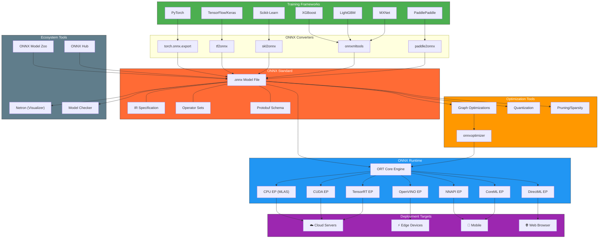
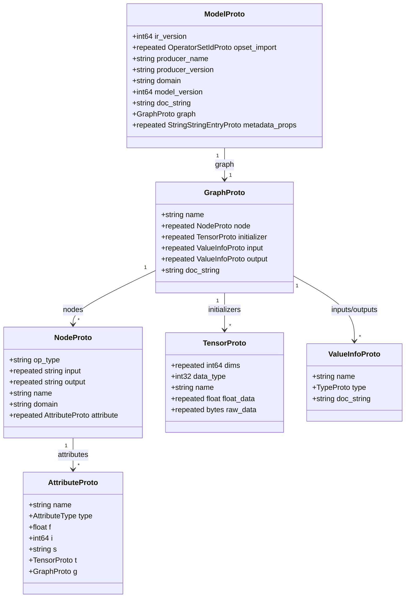

# ONNX Complete Ecosystem Diagram



## Lifecycle Diagram

```mermaid
sequenceDiagram
    participant DS as Data Scientist
    participant TF as Training Framework
    participant ONNX as ONNX Format
    participant OPT as Optimizer
    participant ORT as ONNX Runtime
    participant PROD as Production

    DS->>TF: Train Model
    TF->>TF: Evaluate & Tune
    TF->>ONNX: Export to .onnx
    ONNX->>ONNX: Validate (onnx.checker)
    ONNX->>OPT: Optimize Graph
    OPT->>OPT: Quantize (FP32→INT8)
    OPT->>ORT: Load Optimized Model
    ORT->>ORT: Select Execution Provider
    ORT->>PROD: Deploy (Cloud/Edge/Mobile)
    PROD->>PROD: Serve Inference Requests
```

## Model Architecture (Internal Structure)


